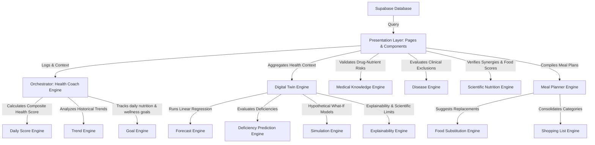
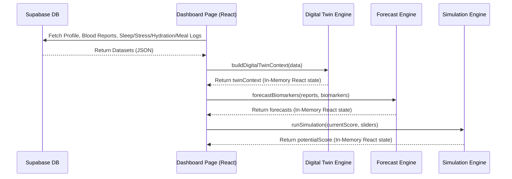

# NutriScan AI - System Architecture Specification

This document details the modular system architecture, data flows, clinical engines structure, and security design of NutriScan AI.

---

## 1. Modular System Design & Engines

NutriScan AI is built as a modular client-side platform powered by independent clinical and nutritional logic engines. This guarantees strict separation of concerns, unit testability, and high-performance in-memory processing.

### Engine Components:
1. **[medical-knowledge-engine.js](file:///d:/NutriScan%20AI/src/lib/engines/medical-knowledge-engine.js)**: Audits active medications to identify drug-nutrient interactions (e.g., Metformin deficiency in B12, Levothyroxine/calcium timing) and applies safety advice.
2. **[disease-engine.js](file:///d:/NutriScan%20AI/src/lib/disease-engine.js)**: Regulates dietary allowances based on conditions (e.g., lowering carbohydrates and increasing fiber for diabetes) and maps food exclusions for celiac disease and allergies.
3. **[scientific-nutrition-engine.js](file:///d:/NutriScan%20AI/src/lib/engines/scientific-nutrition-engine.js)**: Indexes food scores, bioavailability rules (heme vs non-heme iron), mineral absorption competitions, and outputs educational nutrient sheets.
4. **[daily-score-engine.js](file:///d:/NutriScan%20AI/src/lib/engines/daily-score-engine.js)**: Computes the daily wellness score from food logs, sleep, stress, hydration, activity, and active medical conditions.
5. **[trend-engine.js](file:///d:/NutriScan%20AI/src/lib/engines/trend-engine.js)**: Aggregates historical logs to evaluate daily/weekly fluctuations.
6. **[goal-engine.js](file:///d:/NutriScan%20AI/src/lib/engines/goal-engine.js)**: Validates daily targets (hydration volume, sleep hours, activity duration).
7. **[health-coach-engine.js](file:///d:/NutriScan%20AI/src/lib/engines/health-coach-engine.js)**: Integrates all logic to build wellness priorities and prompts.
8. **[digital-twin-engine.js](file:///d:/NutriScan%20AI/src/lib/engines/digital-twin-engine.js)**: Aggregates all profile, logs, and biomarkers in memory into a virtual twin context.
9. **[forecast-engine.js](file:///d:/NutriScan%20AI/src/lib/engines/forecast-engine.js)**: Applies linear regression over blood test logs to project future biomarker values.
10. **[deficiency-prediction-engine.js](file:///d:/NutriScan%20AI/src/lib/engines/deficiency-prediction-engine.js)**: Estimates future micronutrient risks with timeframes and confidence scores.
11. **[simulation-engine.js](file:///d:/NutriScan%20AI/src/lib/engines/simulation-engine.js)**: Calculates the outcome of lifestyle changes in memory.
12. **[explainability-engine.js](file:///d:/NutriScan%20AI/src/lib/engines/explainability-engine.js)**: Clarifies prediction reasoning and bounds.

---

## 2. Data Flow & State Management

All calculations are performed **in-memory** within React components. No clinical datasets, digital twin states, or forecasts are saved locally to `localStorage` or `sessionStorage`. 

---

## 3. Security & Privacy Model

1. **Database Row Level Security (RLS)**:
   * Policies enforce that authenticated users can only insert, select, update, or delete records where `user_id = auth.uid()`.
   * Cross-user access is blocked by default.
2. **Storage Policies**:
   * Documents uploaded to the `medical-documents` bucket are saved under folder paths matching `/auth.uid()/`.
   * Policies verify the prefix matches the caller's JWT, protecting blood test PDFs from unauthorized downloads.
3. **PWA Service Worker Restrictions**:
   * **[sw.js](file:///d:/NutriScan%20AI/public/sw.js)** intercepts fetch events and enforces a strict static-only caching whitelist.
   * It skips caching entirely for requests containing cookies, authorization headers (`Authorization`), or Supabase API headers (`x-client-info`).
   * API endpoints and Supabase paths (`/auth/`, `/rest/`, `/storage/`, `/functions/`) are bypassed to prevent saving health data or JWTs to the SW cache.
4. **Offline Sync Queue Encryption**:
   * **[offline-db.js](file:///d:/NutriScan%20AI/src/lib/offline-db.js)** stores offline actions in a pending IndexedDB queue.
   * Data is minimized (`minimizePayload` strips empty values and autogenerated database keys) and encrypted with XOR-Base64 client-side encryption before writing, preventing exposure of health logs.
   * Synchronized items are immediately deleted from IndexedDB.

---

## 4. Performance & High-Concurrency Patterns

1. **Lazy Loading**:
   * Routes in **[App.jsx](file:///d:/NutriScan%20AI/src/App.jsx)** are split using `React.lazy()` and `Suspense`, preventing loading pages until requested and minimizing initial bundle size.
2. **Concurrent Fetching**:
   * Concurrency is optimized using `Promise.all` in **[DashboardPage.jsx](file:///d:/NutriScan%20AI/src/pages/DashboardPage.jsx)** and **[health-coach-engine.js](file:///d:/NutriScan%20AI/src/lib/engines/health-coach-engine.js)**. Profiling, blood reports, conditions, sleep logs, and meal entries are queried in parallel, reducing fetch overhead.
3. **Caching**:
   * Critical variables and totals are cached inside React's `useMemo` hooks, preventing unnecessary recalculation of daily RDAs, compliance percentages, and goals during component state changes.
