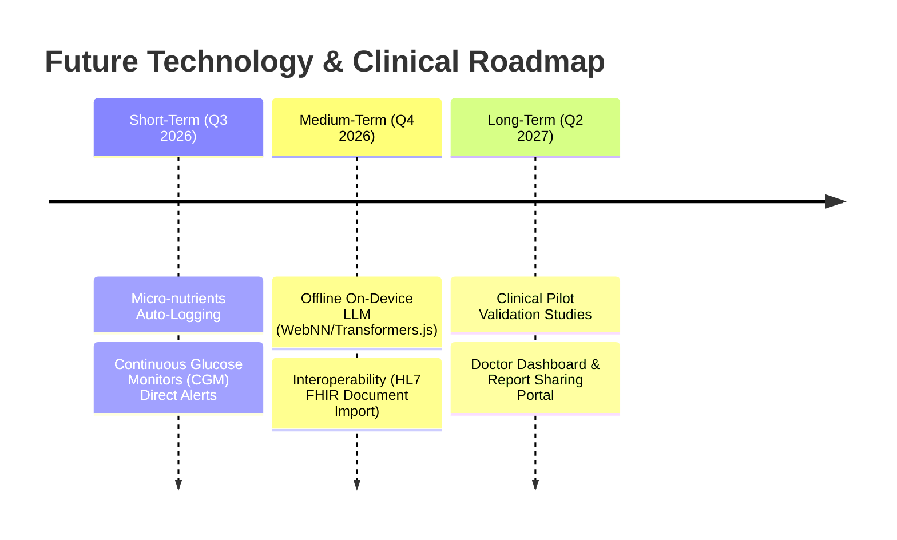

# NutriScan AI - Project Roadmap

This document outlines the development roadmap of NutriScan AI, covering completed phases and future clinical/technological evolutions.

---

## 1. Completed Phases

### Phase 1: Core Nutrition Architecture
* Developed core OCR recipe parsing and food normalization.
* Integrated the USDA and Open Food Facts API providers.
* Configured basic user onboarding profiles.

### Phase 2: Blood Biomarkers & RLS Hardening
* Implemented PDF blood report processing and parsing.
* Standardized biomarker references (normal, low, high limits).
* Hardened database security with Row Level Security (RLS) and bucket policies for document storage.

### Phase 3: AI Health Coach 2.0
* Configured compliance scoring algorithms for different diets (Keto, Vegano, Carnivoro, Celiaco).
* Created the Health Score engine calculating daily wellness values.
* Designed the AI Health Coach prioritizing wellness goals based on blood reports.

### Phase 4: AI Meal Planner & Substitutions
* Designed the personalized weekly meal planner.
* Created the food substitution engine proposing alternatives.
* Consolidated ingredients into classified shopping lists.

### Phase 5: Mobile PWA, Offline Queue & Encryption
* Configured Web App Manifest and Service Worker caching limits.
* Built IndexedDB Sync Queue with client-side XOR-Base64 encryption and data minimization.
* Added push notification support with safe lock-screen templates.

### Phase 6: Preventive Health Intelligence & Digital Twin
* Implemented the Dynamic Digital Twin aggregating clinico-nutritional history in memory.
* Built 60-day linear regression biomarker forecasting.
* Added What-If simulators and explainability modals explaining logic and limitations.

### Phase 7: QA, Clinical Validation & Production Certification
* Built the `verify-clinical-validation.js` test runner.
* Audited math equations, accessibility tags, security bounds, and performance benchmarks.
* Cleared all linter warnings and generated clean production build bundles.

### Phase 8: Health Ecosystem & Wearables
* Unified connection and sync manager supporting Apple Health, Google Health Connect, Google Fit, Fitbit, Garmin, Oura, Withings, and Samsung Health.
* Engineered 4 wellness analysis engines: Recovery, Activity, Heart, and Weight.
* Created 5 new UI dashboard widgets and integrated them in the main dashboard.
* Extended the Recharts timeline to support multi-metric selectors.
* Hardened wearable credentials with private server-side metadata encryption.

### Phase 9: Enterprise Security, Cloud Operations & Production Governance
* Created the centralized logging sanitization framework with SHA-256 ID anonymization and deep PII/clinical scrubbing.
* Separated client and server logging/error monitoring layers (exponential backoff retry systems).
* Implemented client and server sliding-window rate limiters and double-click locks.
* Added automated validation engines for system health, backups, memory leaks, and remote repository secret checking.
* Integrated the System Status administration telemetry card at the bottom of the user dashboard.
* Compiled production operations, deployment runbooks, security specifications, backup rules, and incident response procedures.

---

## 2. Future Evolutions

### Short-Term (Q3 2026)
* **Continuous Glucose Monitors (CGM) Direct Alerts**: Integrate real-time interstitial glucose telemetry alerts (e.g. Dexcom/Abbott API) to proactively warn diabetic/prediabetic users of postprandial blood sugar spikes.
* **Micro-nutrients Auto-Logging**: Enhance recipe analysis to automatically calculate vitamins (A, C, D, B-group) and minerals (Iron, Calcium, Magnesium) from meal descriptions, improving deficiency prediction baselines.

### Medium-Term (Q4 2026)
* **On-Device Offline LLM**: Integrate lightweight models (e.g. Gemma-2B via Transformers.js or WebNN) directly in the browser. This allows users to chat with the AI coach fully offline without sending prompts to external APIs, maximizing privacy.
* **HL7 FHIR Standards Interoperability**: Support importing medical history using standard clinical formats (HL7 FHIR, CCDA XML), allowing users to upload official electronic health records directly.

### Long-Term (Q2 2027)
* **Clinical Pilot Studies**: Partner with nutritional clinics to run pilot validation trials to verify the educational efficacy of the Health Score and simulator in helping users build better habits.
* **Doctor Portal**: Build a secure portal allowing users to export a summary report (e.g., trend charts, dietary compliance, biomarker forecasts) to share with their general practitioner.
